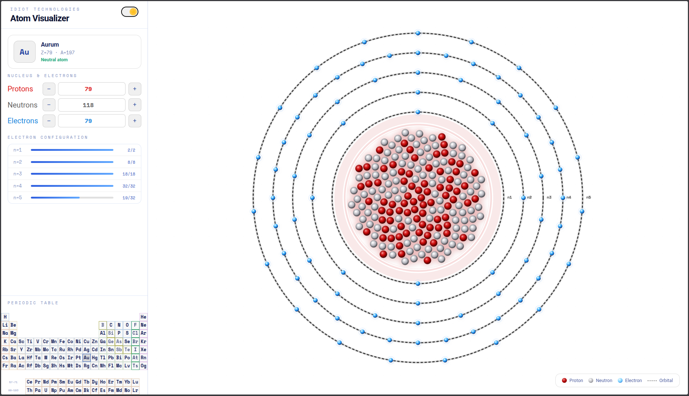
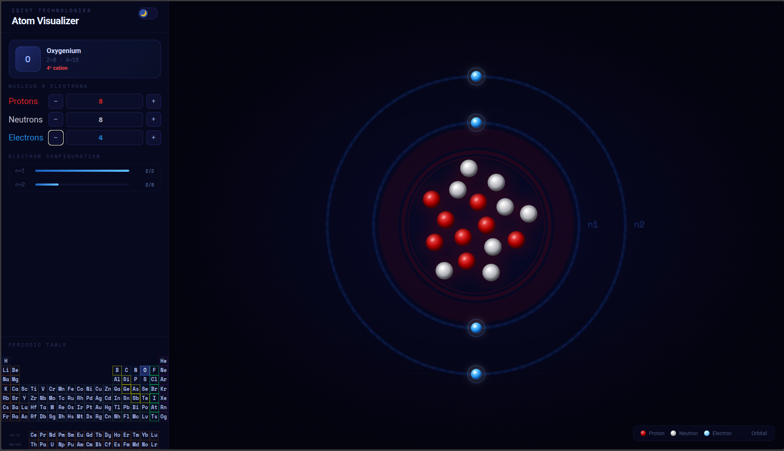
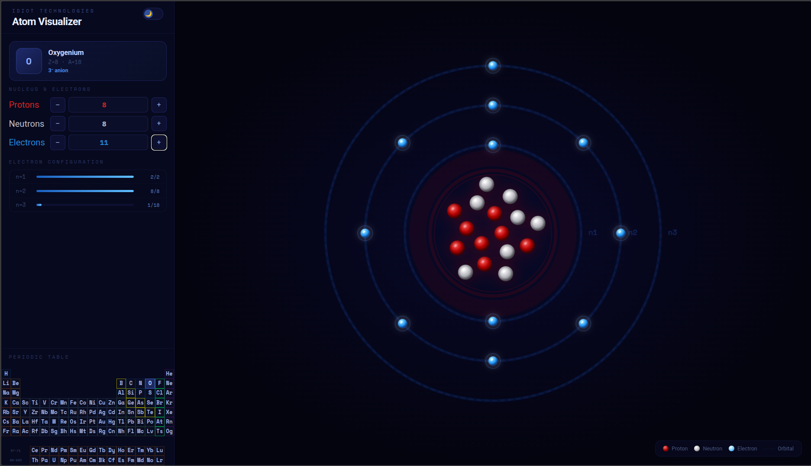
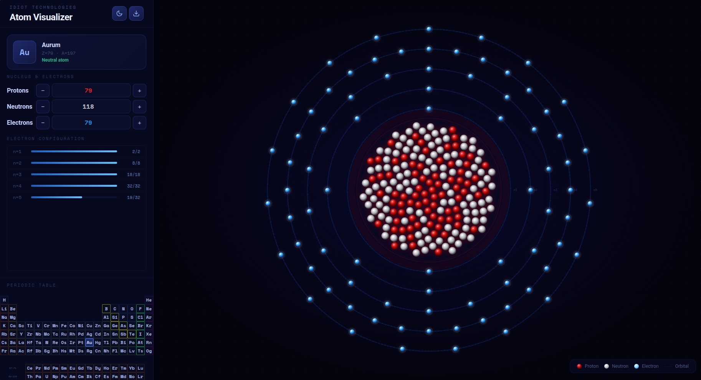

# Idiotom

An atom visualizer. Built it because I needed decent atom drawings for some physics textbook illustrations.

## What it does

- Visualizes atoms with protons, neutrons, and electrons
- Interactive periodic table - click any element to visualize it
- Dark/light mode toggle
- Electron shell visualization
- Cation/anion support (add or remove electrons)
- Shows atomic number (Z), mass number (A), and charge state

## Screenshots

## Usage

Open `Idiotom.html` in any browser. No install needed.

## Known limitations

- No SVG export yet - screenshots for now
- Electrons are positioned roughly using electron configuration rules, not quantum mechanics

## License

Make a nuclear bomb if you wanna, just don't blow yourself up <3

---

## TODO

- [ ] Add SVG export
